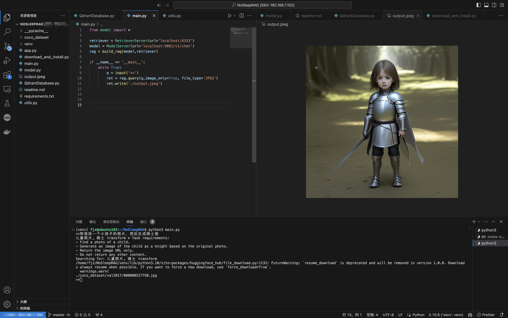

# NoSleepRAG,不需要sleep的RAG
## 简介

本项目旨在解决检索增强生成（RAG）过程中需要进行time.sleep问题。我们通过细分任务、图像和文本嵌入、向量数据库以及图生成技术，实现了高效且准确的RAG模型，该项目向量数据库构建时使用了coco部分数据集。


## 使用技术

- **GPT-4o 细分任务**: 使用GPT-4o模型将复杂任务细化为可管理的小任务。
- **CLIP 嵌入**: 利用CLIP（Contrastive Language–Image Pre-training）实现图像和文本的嵌入。
- **Qdrant 向量数据库**: 使用Qdrant构建高效的向量数据库，以存储和检索嵌入数据。
- **Stable Diffusion 图生图**: 利用Stable Diffusion技术从给定的图像生成新图像。

## 安装步骤

1. 克隆仓库：
    ```bash
    git clone https://github.com/telesccope/NoSleepRAG.git
    cd NoSleepRAG
    ```

2. 安装依赖：
    ```bash
    pip3 install -r requirements.txt
    ```

3. 下载coco数据集：
    ```
    python3 download_dataset.py
    ```
    
3. docker启动qrdant
    ```
    docker pull qdrant/qdrant
    docker run -p 6333:6333 qdrant/qdrant
    ```

4. 启动stable diffusion web ui
    具体见 https://github.com/AUTOMATIC1111/stable-diffusion-webui

5. 配置环境变量：
    ```bash
    export OPENAI_API_KEY="your api key"
    ```

## 使用方法
### 1. 初始化向量数据库
```
python3 QdrantDatabase.py
```
### 2. RAG
```
python3 main.py
```